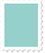

# Content types

<ul class="big icons">
	<li><a href="">

Benefit
</a></li>
	<li><a href="">

Guide
</a></li>
	<li><a href="">

Quick answer
</a></li>
	<li><a href="">

Service
</a></li>
</ul>

# Inside Government

<ul class="big icons">
	<li><a href="">

Departments
</a></li>
	<li><a href="">

Ministers
</a></li>
	<li><a href="">

UK &amp; The World
</a></li>
</ul>

# Actions and information

<ul class="small icons">
	<li>
		<a href="pngs/close.png">	
			

					
					
			

			
Close

		</a>
	</li>
	<li>
		<a href="pngs/download.png">
			

					
					
			

			
Download

		</a>
	</li>
	<li>
		<a href="pngs/important.png">
			

					
					
			

			
Important

		</a>
	</li>
	<li>
		<a href="pngs/information.png">
			

					
					
			

			
Information

		</a>
	</li>
	<li>
		<a href="pngs/location_marker_36px.png">
			

					
					
			

			
Location

		</a>
	</li>
	<li>
		<a href="pngs/thumbs_down.png">
			

					
					
			

			
Thumbs down

		</a>
	</li>
	<li>
		<a href="pngs/thumbs_up.png">
			

					
					
			

			
Thumbs up

		</a>
	</li>
	<li>
		<a href="pngs/postage_stamp.png">
			

					
					
			

				
Address

		</a>
	</li>
</ul>
