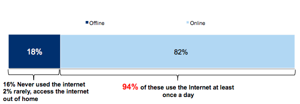
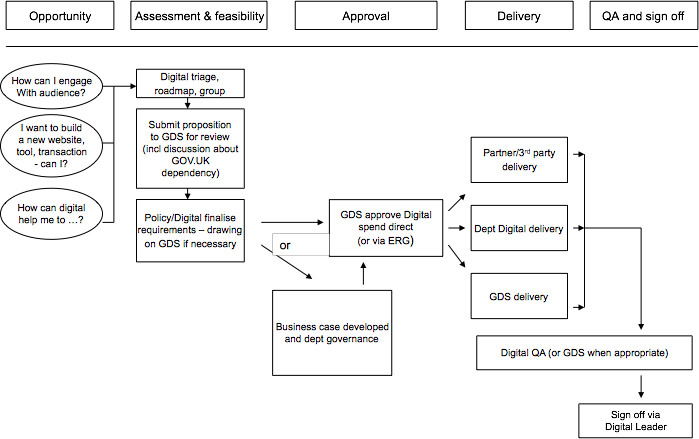

##UK Government Digital Strategy
{:.no_toc}

####October 2012
{: .section-subtitle}
{:.no_toc}

DRAFT

Not for wider circulation

* * * * * 

####Contents
{: .section-subtitle}
{:.no_toc}

* Will be replaced with the table of contents
{:toc}

##01Executive summary
{: .section-title}

This strategy sets out how the Government will become Digital by
Default. It fulfils the commitment we made in the Civil Service Reform Plan.

By Digital by Default, we mean digital services which are so
straightforward and convenient that all those who can use them will
choose to do so whilst those who can't are not excluded.

The actions in the strategy will start to transform central government
services and improve the way the government makes policy and
communicates with people. We will take a consistent, coordinated
approach across the whole of government, to provide better services for
users and reduce government costs.

We estimate that moving services from offline to digital channels will
save between &pound;1.8 and &pound;2.1 billion a year.

Government is improving the way it provides information by moving to a
single website, GOV.UK. Transactional services now present the biggest
opportunity to save people time and save the government money.

People will only choose to use government services digitally if they are
far more straightforward and convenient. The vast majority (82%) of the
UK population is online but most people rarely use online government services.

The government provides more than 650 transactional services. There is
only a handful of these services where a large majority of people who could use the
online option do. Many have a digital option, but few people use it.
Half don't offer a digital option at all.

We will:

####Improve Departmental digital leadership
{: .section-subtitle}

Departmental executive boards will include an active digital leader.
Transactional services handling over 100,000 transactions each year will
be re-designed, operated and improved by a suitably skilled, experienced
and empowered service manager.

####Develop digital capability throughout the Civil Service
{: .section-subtitle}

All departments will ensure that they have the right levels of digital
capability in-house, including specialist skills. Cabinet Office will
support improved digital capability across departments.

####Redesign transactional services to meet a new Digital by Default service standard
{: .section-subtitle}

All departments will undertake end-to-end service redesign of all
transactional services with over 100,000 transactions per year. All new
or redesigned transactional services going live after April 2014 will
meet a new Digital by Default service standard.

The seven departments with most transactions (HM Revenue and Customs,
Department for Transport, Department of Work and Pensions, Ministry of
Justice, Department for Business, Innovation and Skills, Department for
Environment, Food and Rural Affairs and Home Office) will agree three
significant exemplar service transformations with Cabinet Office. These
will be identified in departmental digital strategies in December 2012.
They will be incorporated into departmental business plans for 2013/14.
Departments will start to redesign these exemplar services by April 2013
and implement them by March 2015.

####Complete the transition to GOV.UK
{: .section-subtitle}

Corporate publishing activities of all 24 central Government Departments
will move onto GOV.UK by March 2013, with agency and arms length bodies'
online publishing to follow by March 2014.

####Increase the number of people who use digital services
{: .section-subtitle}

Departments will raise awareness of their digital services so more
people know about and use them, and look at ways to use incentives to encourage digital
adoption.

####Provide consistent services for people who have rarely or never been online
{: .section-subtitle}

It is important we do not leave anyone behind in this move to a Digital
by Default approach. Departments will recognise and understand the needs
of people who cannot use digital services. Digital by Default services
will provide appropriate support for these people to use digital
services and other ways to access services for people who need them.

####Broaden the range of those tendering to supply digital services
{: .section-subtitle}
including more small and medium sized enterprises

Cabinet Office will offer leaner and more lightweight tendering
processes, as close to the best practice in industry as our regulatory
requirements allow.

####Build common technology platforms for Digital by Default services
{: .section-subtitle}

Cabinet Office will lead in the definition and delivery of a new suite
of common technology platforms, to underpin the new generation of
Digital by Default services.

####Remove unnecessary legislative barriers
{: .section-subtitle}

Cabinet Office will work with departments to amend legislation that
unnecessarily prevents us from developing straightforward, convenient
digital services.

####Base service decisions on accurate and timely management information
{: .section-subtitle}

Departments will supply a consistent set of management information, as
defined by the Cabinet Office, for their transactional services.

####Improve the way that the Government makes policy and communicates with people
{: .section-subtitle}

Departments will encourage policy teams to use a wider range of digital
tools to communicate with and consult people, both within the UK and
overseas.

This strategy is just the beginning of Digital by Default. We recognise
that the changes required will be far from easy. Our existing processes
and ways of working can get in the way, and many will need to change.

By December 2012, each department will publish their own departmental
digital strategy explaining what actions they will take to contribute to
this strategy. Their actions will be included in their business plans
for the next financial year and provide a framework for continuing
improvements in their services.

Cabinet Office will operate an annual review process to track
departments' progress against the actions in this strategy.

The strategy does not cover local government services, the expansion of
the broadband network, the NHS or increasing the digital capability of
UK citizens.

##02Introduction
{: .section-title}

This strategy contains fourteen actions the government will take to
become Digital by Default. Digital by Default means digital services
which are so straightforward and convenient that all those who can use
digital services will choose to do so, while those who can't are not
excluded.

This follows the [Civil Service Reform Plan]() by developing services
that:

-   allow straightforward access to information and services in times
    and in ways that are convenient to the users rather than the
    providers; and
-   are more efficient and cost-effective to develop and run.

If we successfully transform our services so they are Digital by
Default, we can earn a reputation for offering high-quality, responsive, convenient and
up-to-date services.

We made the commitment to Digital by Default in **response** to the review
of Government Online ('Directgov 2010 and Beyond') by Martha Lane Fox as UK
Digital Champion in 2010.

In his Foreword to the 'Civil Service Reform Plan', Francis Maude said:

> "Central Government where possible must become a digital organisation.
These days the best service organisations deliver online everything that can be
delivered online.
This cuts their costs dramatically and allows access to information and
services at times and in ways convenient to the users rather than the
providers".

The Government Digital Service will implement this strategy, supported
by the Digital Leaders' network of senior civil servants, the Digital
Advisory Board and the Government Communication Network.

Each government department will prepare and publish its own departmental
digital strategy. These documents will explain how departments will make
their services Digital by Default in ways that work for their users.
These strategies will be published by the end of 2012, in time to
influence departments' 2013/14 business plans. They will set the
framework for service transformation over the lifetime of the next
spending review.

##03What the strategy is about
{: .section-title}

This strategy is mainly about the services provided by central
government departments and associated agencies and arms length bodies.
Some matters covered by the strategy are devolved and reference should
be made to the Devolved Administrations for more details as to how this
strategy affect their areas.

However, in order to provide public services Digitally by Default, all
public bodies will need to work together. Most public services are
provided by local organisations such as local councils and the NHS.
People often use a range of services, not just one at a time. Most
people and businesses don't differentiate between different levels and
types of public services; they just want a good service.

To help other organisations improve their digital services, we will:

-   make the digital assets (standards, designs and code) generated as
    a result of this strategy widely available
-   share central government plans with local authorities and other
    public bodies
-   work with local authorities and their representative and
    professional bodies to help them to make improvements

The actions in this strategy are mainly about transactional services
like applications, tax, licensing and payments. The strategy explains
how the civil service will develop new skills and approaches to
complement its existing expertise. It also includes actions to improve
the way the government makes policy and communicates with people.

This strategy is about users of services within the UK. Users overseas
will be covered in appropriate departmental strategies.

We have already stated our ambition is to provide superfast broadband to
at least 90 per cent of premises in the UK and to provide universal
access to standard broadband with a speed of at least 2Mbps2.

###The benefits of Digital by Default
{: .section-subtitle}

Digital by Default services are more efficient and more convenient for
users. Our initial testing comparing GOV.UK to the previous Directgov
and Businesslink sites shows a more positive rating on both ease of use
(93% compared with 75% before) and speed (80 seconds as opposed to 120
seconds to undertake comparable transactions).

Government will save money if demand for higher cost channels decreases.
A 2012 SOCITM study3 across 120 local councils estimated that the cost
of contact for face to face averages &pound;8.62, for phone &pound;2.83, but for web
only 15 pence. The Digital Efficiency Report found that the average cost
of a central government digital transaction can be almost twenty times
lower than the cost of telephone and thirty times lower than face-face4.

In 2010 HMRC estimated that around 35% of calls to its contact centres
were avoidable5 at an National Audit Office estimated cost of &pound;75m a
year. Changes have since been made to processes, letter and forms that
have reduced the total number of calls and the proportion of avoidable
calls to around 26% of the total.

On the basis of historical savings achieved by existing digital services
we estimate that &pound;1.8 to &pound;2.1 billion of total annual savings could be made by shifting
the transactional services offered by central government departments from offline to
digital channels. Of this, &pound;1.2 to &pound;1.4 billion will be saved directly by the government,
with the rest passed on to service users through lower prices. These figures do not include
the potential costs of a transition to digital, but also do not include the additional
savings that could be gained from fundamental service redesign or back-end technology
changes.

######Figure 1: Speed of take-up
{: .section-subtitle}

Evidence from the Digital Efficiency Report case studies demonstrates
public services exhibiting a typical technology adoption S-curve. For
services at around 20% digital take-up, there is the opportunity to
rapidly increase adoption to 80% within 3-5 years. This will be further
increased where digitisation is accelerated by a process of fundamental
service redesign based on user needs

Digitising transactional services will save people and businesses time
and money, by making transactions faster, reducing the number of failed
transactions and simplifying the end-to-end process. Our estimates
suggest that an hour spent interacting with government costs the average
citizen &pound;14.706. If just half an hour were saved by digitising every
transaction currently completed offline, the total savings to the
economy could therefore be around &pound;1.8billion7. Furthermore, many public
services are run by agencies that recover their costs directly through
user charges, so reducing costs provides the potential for savings to be
passed on to users.

##04The potential for more people to use government digital services
{: .section-title}

###People who are already online
{: .section-subtitle}

There is a clear opportunity for government to deliver services
digitally to people who are already online. 77% of adults in the UK use the internet daily,
but many of them have never had any online interaction with the
government8.

######Figure 2: UK adult population by internet use
{: .section-subtitle}
*Source: Cabinet Office, Digital Landscape Survey, August 2012*

A growing proportion of people are willing and able to use more complex
digital services that involve a high level of trust such as shopping and
online banking9. Oxford Internet Institute research shows the proportion
of internet users who shop online grew from 74% in 2005 to 86% in 2011;
online banking usage grew from 45% in 2005 to 60% in 2011; and internet
users who pay bills online grew from 39% in 2005 to 57% in 2011.

The popularity of online channels is recognised across the private
sector, demonstrated by the fact that internet advertising's share of
total UK ad spend has risen to 33%, well ahead of any other country, as
UK advertisers respond to their customers' attention shifting online10.

Furthermore, digital services are rapidly gaining strong reputations and
loyalty from users. A recent YouGov poll saw Amazon, Google and iPlayer
become the highest-rated brands in the UK, overtaking more traditional
companies such as John Lewis and Marks and Spencer11.

The people who use digital services do so for reasons of speed and
convenience. The most frequent reasons people gave for their choice to use digital
transactions were: it saves time (85%), the site was clear and easy to use (62%) and
availability outside office hours (61%)12.

Between 2000 and 2009, the number of people using government's digital
information and transactions steadily increased but, in recent years,
this reach has plateaued. 46% of UK adults have used a government service online,
but most of those have used only a small number of services, and many
have just used one.

######Figure 3: Breakdown of UK population by use of government digital services and internet use
{: .section-subtitle}

Helping more people to use online services

Not everyone is online. Through our assisted digital programme, we will
help more people to use online services.

Those in higher socio-economic groups are more likely to be online, with
92% of ABCs online (regularly or occasionally access the internet). 28%
of disabled people are not online (rarely access/have never used the
internet), and older people are more likely to be offline than other age
groups, (however 59% of people aged over 65 are online)13. Geography
doesn't appear to have too great an influence on whether people access
the internet or not, as people are offline in urban, suburban and rural
areas.

A third of the people who are offline said they are interested in using
the internet (6%), suggesting that the number of people who are online
may increase over time.

###People who use mobile devices to get online
{: .section-subtitle}

Digital services must adapt seamlessly to meet the needs of mobile
internet users. The new digital service standard will include a
requirement to design digital services that are usable on mobile devices
as well as desktop and laptop computers.

In recent years there have been large advances in the portability and
range of internet enabled devices. This has changed the way users access
the internet. The most popular devices used to access the internet are
laptops and desktops (71% and 59% respectively), but mobile phone
ownership is now widespread (86% of UK adults have a mobile phone). 56%
of UK adults own a mobile that is internet-enabled, and their use to
access the internet is growing14.

The London 2012 Olympic Games provides a recent example of this trend
towards mobile use, with over 60% of all visitors to the Games' website
coming from mobile phones15.

Ownership of internet-enabled phones continues to grow among all income
groups. This will increase the number of people who can access the
internet. There is little correlation between the use of mobiles for the
internet and annual income, with 35% of mobile internet users earning
above &pound;30,000 and 39% earning below &pound;12,500. With 69% of current
non-internet users owning a mobile there is scope to increase access to
internet-based information and services through this route16.

Based on banking industry experience, this mobile web usage tends to be
focused on simple straightforward transactions, notably progress
tracking. This offers the potential to shift a high volume of this type of transaction across to digital
self-service, resulting in savings from reduced use of higher-cost telephony channels.

##05What we have already done
{: .section-title}

Government's online information services are closer to becoming users'
preferred (default) option than its transactional services.

Government online publishing is in the process of being transformed by
the GOV.UK programme, a radical simplification of government web
publishing started in 2011 in response to Martha Lane Fox's review. The
GOV.UK website (which replaced the previous Directgov and Businesslink
sites in October 2012 in providing government information for citizens
and businesses) has already demonstrated that it is simpler, clearer and
faster for users.

Government already uses digital channels for most of its communications,
marketing and engagement. Most departments and many agencies have
developed expertise in using social media and other third party digital
properties such as YouTube to communicate with people and businesses,
rather than paying for other channels. [The Red Tape
Challenge](http://www.redtapechallenge.cabinetoffice.gov.uk/home/index/)
and [e-petitions](http://epetitions.direct.gov.uk/) are two examples of
this approach.

Government has also made some progress in providing convenient,
well-used and well regarded transactional digital services. For example,
digital is the preferred channel for most users of Companies House, with
an 89% online take up of annual returns search and filing achieved in
just five years17, and for HMRC's Self Assessment tax service where a
record 80% of returns were filed online in 2011/1218.

Progress is also being made in making government information and
transactions more widely and conveniently available through third
parties. Over two thirds of the 7.65 million Self Assessment
transactions received online by HMRC are submitted via third party
software and service providers19. Over 100 such third party commercial
providers are accredited to use HMRC's third party integration suite
(APIs).

Around 30 percent of digital filings to Companies House are made via its
software filing service which offers an API for the transmission of data
from commercial software packages. The clients of over 80 software
providers use this service.

##06Developing digital transactions
{: .section-title}

Transactional services are the primary focus of this strategy. This is
because developing transactional services offers the greatest scope to
improve efficiency and the customer experience. And despite the progress
outlined above, they are also the area where there is the most work to
be done to improve the digital offer and increase user take up.

There is a huge volume of transactions with government. There were
around 1 billion individual transactions a year with central government
departments in 2011/12. This number rises to nearer 1.5 billion when
other governmental organisations such as local government are taken into
account20.

These transactions are not evenly spread across departments, with just
seven responsible for around 90% of the central government transactions.
These are Her Majesty's Revenue and Customs (HMRC), Department for
Transport, Department for Work and Pensions, Department for Business,
Innovation and Skills, Department for Environment, Food and Rural
Affairs, Ministry of Justice and the Home Office.

Whilst the majority of transactions are between government and
individuals, there are also a significant number of transactions between
government and business. This includes some which are very complex and
high value (for example farming payments). In these cases, the use of
specialist third party intermediary organisations is common. The process
improvements recommended in this strategy will support these
arrangements.

###What is preventing people from using digital transactions?
{: .section-subtitle}

Most government transactions fall far short of the standard of the best.
Unlike successful digital services in the private sector, government's
online services are not necessarily better or more convenient than other
channels, meaning they will not be users' first choice to transact with
us.

For example, in some circumstances, it is quicker to apply for some
services by phone than by using the existing online service. In 2011,
around 150 million calls a year coming into government were
self-reported as avoidable21. Such failure is frustrating and
time-consuming for users but it is also costly for government. If users
have to revert back\
to other channels, then meeting this additional 'failure demand' is an
unnecessary additional cost.

There are several causes of these failures. Many government services
rely on digitised versions of pre-digital business processes, layered on
top of legacy IT, some of which is over 30 years old. They were not
designed with a digital service in mind, being built to replicate paper
forms and processes rather than taking advantage of opportunities to\
pre-populate or respond to user's selections. They have out-dated back
end systems which prevent effective data sharing, and/or they have
long-term contracts locked into expensive vendors making changes to
services costly and slow.

Each service has often been designed individually, rather than
developing a consistent approach to user experience across the
government digital estate. Hence the user experience of government
transactions is inconsistent and unnecessarily confusing, particularly
to less confident users.

Leading private sector digital businesses have learned that familiarity
drives usage, and usage drives familiarity. This lack of a consistent,
high quality user experience is a critical issue holding back
performance and adoption of our digital services.

Despite evidence of growing use of mobile devices as the route into
digital channels, only a handful of government digital services cater
fully for the needs of mobile internet users. Very few government
digital services are flexible or agile enough to keep up with the rapid
changes in user behaviour typified by the growth of the mobile sector.
If existing lengthy procurement processes and inflexible development
models continue, they will be similarly poorly placed to adapt at any
pace to future changes in how people prefer to use the internet.

The 'Civil Service Reform Plan' acknowledges that we need to develop the
right capability and skills to design, communicate and deliver the
high-quality digital services we require. This digital strategy aligns
with the Civil Service Capabilities Plan; both will be woven into
departments' own strategic planning, including their new Improvement
Plans.

There has been an over-reliance on a handful of large systems
integrators, referred to by the Public Administration Select Committee
(PASC) as an 'oligopoly'22. As a result, the civil service does not have
the necessary depth of understanding and ownership of our digital
channels to act as an "intelligent client". This makes services less
efficient and less effective for users.

There are also weaknesses in the consistency, timeliness, accuracy and
scope of management information to measure performance and costs between
different services and channels. This means we may miss opportunities to
target areas of waste, identify improvement opportunities or measure the
benefits of change.

##07Assisted Digital
{: .section-title}

We recognise that not everyone who uses government services is online,
and that the people who are least likely to be online are the people who
most rely on government services.

Not everyone will be able to use digital services independently, and the
government has to ensure fair access to its services for those who are
entitled to them. To design services that work for users, we need to
understand who can use digital services, who can't, and what else we
need to provide for people who aren't online.

What we provide for people who aren't online will depend on the service
and the needs of the user. Many people who are offline will keep using
the services in non-digital ways, such as face to face, by phone and
through intermediaries. In some cases, people may be offered help to use
the digital channel.

We call this 'assisted digital'. This is an integral part of providing
Digital by Default services. Departments will consider how they will
provide this assistance at the same time as they are digitally
transforming their services. Government Digital Service will work with
departments to develop a cross-government approach to this issue. This
is to ensure those users who need this help receive a consistent service
across the multiple services they use.

##08Persuading those who are online to use government digital services
{: .section-title}

We want those who are able to use our digital services to do so. For
those who can and do use digital services already, the actions outlined
in this strategy will result in a better user experience and a wider
range of high quality digital services.

To persuade people to use government digital services, we need to
improve the quality of the services to make them clearly preferable to
the alternatives.

We also need to make people aware of the services that are available. A
number of techniques can be used to raise awareness and encourage people
to use digital channels. Departments will consider which methods are
most appropriate to the context of their service, and the needs of their
service users.

Departments will learn from the expertise of organisations who have
successfully undertaken "channel shift" to digital services.

###What about things that can't be done online?
{: .section-subtitle}

Not every step of every interaction with government can, or should, be
entirely digitised -- a practical driving test cannot be taken online.
But even services that inherently involve face to face contact can be
redesigned - digitally - around the needs of users.

For example, while over 90% of practical driving tests are booked
online, driving examiners still fill in and file paper forms to confirm
who has passed their test, adding cost and delay for users that a truly
end-to-end digital service could remove. The Driving Standards Agency is
planning to introduce tablet computers so that examiners don't have to
fill in paper forms. They will be able to pass on test information to
the next stages of the process more swiftly and efficiently.

Over time, the success of better designed digital services will allow
government to reduce the scale and profile of less convenient, effective
and cost-efficient contact methods (telephony, face to face, post).

###Redesigning services around the needs of users
{: .section-subtitle}

The most important part of this strategy is the need to redesign
government services to respond to user needs.

We can learn lessons from other organisations which are succeeding in
digital transformation such as high-street banks or the BBC:

-   Basing service design on user needs is essential to ensure quality
    and reduce the cost of failure waste
-   Modern, flexible, common technology platforms are needed for
    frequently iterated, consistent user-focused services
-   Policy and delivery are best tightly integrated into one
    co-located team during any redesign of a digital service
-   Specialist technical architecture, development, design and
    analytics skills are essential, alongside new senior leadership
    roles, including that of a fully accountable and empowered service
    manager
-   Once services are redesigned to meet user needs, they need to be
    communicated and marketed effectively, by targeting appropriate
    messages to identified user groups through a range of trusted
    channels and intermediaries

###How the civil service needs to develop
{: .section-subtitle}

Measured against the European Digital Capability Framework23 set out
below, departments are currently at varying levels of digital maturity.

By taking the approaches and actions set out in Section 9 we will make
progress in all departments towards the highest levels of strong, agile,
responsive and, above all, user-centred digital service provision.

##09Actions and Themes
{: .section-title}

We have 14 actions, which we group under eleven themes.

Departments will publish their own digital strategies by the end of 2012
setting out how they and their agencies and arms length bodies will
apply these principles to transform their own services to make them
Digital by Default.

###Improve departmental digital leadership
 {: .theme-head}
{: .section-subtitle}

*"Proven leadership in digital transformation"*

####Action 1: Departmental and transactional agency boards will include an active digital leader
{: .section-subtitle}

-   Departments will ensure they have in place engaged, active,
    board-level leadership of service transformation
-   Digital Leaders will lead on development and delivery of
    Departmental Digital Strategies.

####Action 2: Services handling over 100,000 transactions each year will be re-designed, operated and improved by a suitably skilled, experienced and empowered Service Manager
{: .section-subtitle}

-   Service Managers will be in place for new and redesigned
    transactions from April 2013
-   Departments will ensure all transactional services have clearly
    identified Service Managers by March 2015

Government Digital Service will

-   Offer extensive training and support to help new Service Managers
-   Help departments to recruit Service Managers

Private sector organisations which have been at the forefront of
delivering internal digital transformation have repeatedly indicated the
importance of leadership at all levels to their success. It is therefore
important that we ensure that suitably skilled and empowered leadership
is in place within departments and agencies to lead service
transformation.

Digital Leaders will provide active senior leadership for Departmental
Digital Strategies and activities and provide expertise and challenge to
their boards24. The Cabinet Office will help boards to identify Digital
Leaders with suitable experience and skills (role specification in Annex
5). These will usually be members of the Departmental Executive (or
Management) Board. In a number of departments, these are already in
place.

In agencies and arms length bodies which deliver significant
transactional services, similar active board-level leadership is
critical to achieving successful service transformation.

Outside government, organisations in the public and private sector are
learning that empowered, experienced and highly skilled managers (often
called 'product managers' in the commercial world) are necessary to
deliver high-quality digital services.

Government will adopt the same model, and ensure each of its
transactional digital services above 100,000 transactions per year is
developed, operated and continually improved by a suitably experienced,
skilled and empowered Service Manager. 
These are not technical IT posts, nor are they confined to running a
website. Instead, they are individuals who work full-time to develop and deliver
all the changes necessary to provide effective digital services. With a
handful of exceptions, this is a new role within government. These
Service Managers will:

-   be experienced leaders, with an in-depth understanding of their
    service (built on continuity of involvement over a period of years)
    and equipped to represent their service and its users' needs at all
    levels within the organisation. For high-profile services these will
    be at Senior Civil Servant level;
-   be accountable for the quality and usage of their service, and
    able to iterate the service based on user feedback at least every
    month;
-   be able to lead effectively on the change management and process
    re-engineering required to implement successful services;
-   have the digital literacy to engage with technical staff and
    suppliers to define the best system and platform configurations to
    achieve business/user objectives;
-   encourage the maximum possible take-up of their digital service by
    effective marketing, and specify/manage the requirements for
    assisted digital activity to supplement this;
-   oversee service redesign and subsequent operational delivery;
    supporting and ensuring the necessary project and approval processes
    are followed, monitoring and reporting on progress in line with the
    Digital by Default service standard, identifying and mitigating
    risks, and be empowered to deliver on all aspects; and
-   actively participate in networking with other Service Managers
    inside and outside government, and share good practice and learning.

The Cabinet Office will help departments to recruit suitably skilled
individuals. Newly appointed Service Managers will be supported by
Cabinet Office through a specialist training programme run by the
Government Digital Service. This will include the hands-on process of
designing and prototyping a digital service.

###Develop digital capability throughout the Civil Service
 {: .theme-head}
{: .section-subtitle}

*"Becoming a digital civil service"*

####Action 3: All Departments will ensure that they have appropriate digital capability in-house, including specialist skills
{: .section-subtitle}

-   Departments will have sufficient specialist capability to assess
    and manage their portfolio of digital services
-   Plans to improve departments' digital capability will be included
    in Departmental Digital Strategies and departmental business plans
    for 2013/14

####Action 4: Cabinet Office will support improved digital capability across departments
{: .section-subtitle}

-   Service Managers will be offered an extensive programme of
    training and support, run by Government Digital Service from summer
    2013
-   Senior officials across all departments will be offered training
    to highlight the strategic opportunities offered by digital from
    summer 2013
-   The revised Graduate Fast Stream programme will look for placement
    opportunities with a digital delivery service
-   Digital skills development across all grades will be a priority in
    the forthcoming Civil Service Capabilities Plan, supported by Civil
    Service Learning

Government Digital Service will

-   Increase support to departments' transactional service redesign
    projects
-   Help departments to improve their digital capability, including
    providing guidance on request about effective approaches to
    recruiting digital specialists
-   Develop extensive bespoke training and support for Service
    Managers
-   Work with Civil Service Learning to develop digital awareness
    training for civil servants

All Departments should ensure that they have appropriate in-house
specialist digital capability, including the management of their
portfolio of digital services. This capability will vary in size and
skill-sets depending on the balance of information and services the
department is responsible for. It will typically include specialist
digital skills in digital service design, development, analytics,
digital strategy, on-line publishing and product management. Departments
with lower volumes of transactions could share specialist digital
resources.

Government Digital Service is already working with departments to
support seven transformational service redesign projects. This support
will continue, and be extended. Annex 2 describes the support that is
available.

To complement this internal development, approaches to recruitment will
need to be adapted to attract staff with appropriate skills from outside
government. Departments will also provide opportunities for existing
staff to develop the required digital skills.

#####Specialist training and support for Senior Civil Servants
{: .section-subtitle}

Government Digital Service will help Civil Service Learning to develop
training for senior civil servants to raise their awareness of the
opportunities offered by digital to improve a wide range of policy
outcomes.

#####Fast Stream and Future Leaders
{: .section-subtitle}

Digital skills and leadership will be incorporated into the new
government-wide approach to active corporate management of current and
future leadership from Fast Stream through to future Permanent
Secretaries (set out in the 'Civil Service Reform Plan').

Where possible Fast Stream entrants should spend one of their six month
placements during their first two years in a digital role. The new
Future Leaders Scheme will aim to give middle managers operational
management experience in a digitally delivered service area as part of
overall career planning.

#####The wider civil service
{: .section-subtitle}

General digital training activity across the wider civil service will be
included in the government's capability building programme, led by Civil
Service Learning. Departments will ensure appropriate levels of digital
skills are part of core competencies, performance and objective-setting
frameworks at all levels.

###Redesign transactional services to meet a new Digital by Default service standard
 {: .theme-head}
{: .section-subtitle}

*"Digital services so good that all who can use them, prefer to use them"*

####Action 5: All Departments will redesign services with over 100,000 transactions per year
{: .section-subtitle}

For the seven 'transactional' departments25:
-   three significant 'exemplar' services will be agreed with Cabinet
    Office and identified in Departmental Digital Strategies in December
    2012. They will be included in their business plans for 2013/14.
-   Redesign will start by April 2013 and the service must be
    implemented by March 2015.
-   Following this and using the learning from the exemplars,
    departments will redesign all services handling over 100,000
    transactions each year. The deadlines for completion of each service
    will be included in the annual update to the departmental business
    plan following agreement from Cabinet Office.

For the remaining Departments:
-   departments will redesign all services handling over 100,000
    transactions each year. The deadlines for completion of each service
    will be included in the annual update to the departmental business
    plan following agreement from Cabinet Office.

#### Action 6: From April 2014, all new or redesigned transactional services will meet the Digital by Default service standard
{: .section-subtitle}

Government Digital Service will

-   Publish the Digital by Default service standard, which will
    describe the performance metrics and capabilities that services must
    achieve. An indicative outline is published\
    in Annex 3
-   Provide a programme of support, guidance and tools that help
    service teams meet the standard throughout the development and life
    of the service.
-   Agree with departments the deadlines for when digital services are
    to be redesigned
-   Increase the scale of its transformation team to support more
    transactional service redesign projects
-   Help departments to share what they learn from exemplar projects

Government digital services are inconsistent and often do not meet the
standards that users expect. To ensure that users receive a consistently
high-quality digital experience from government, Cabinet Office will
develop a 'Digital by Default' service standard for all digital
services. No new or redesigned service will go live unless they meet
this standard.

The full standard will be published by the Cabinet Office by April 2013.

In summary, it will require redesigned digital services to:

-   Be developed based on user need using agile, iterative, digital
    development methodologies and using open source code by default.
-   Be designed, run and continually improved by a suitably skilled
    and empowered\
    Service Manager.
-   Be iterated at least monthly based on qualitative feedback from
    users and quantitative measures from analytics.
-   Be designed for inclusion, so all who should use it can use it,
    and include appropriate assisted digital support for people who
    can't.
-   Offer high-quality APIs, allowing departments to integrate
    services, and make these available to third-parties where there is a
    demonstrable user benefit.
-   Be designed to work well on a wide range of web-enabled devices,
    including mobile phones. Stand-alone mobile apps will only be
    considered once the core web service works well on mobile devices,
    and if specifically agreed with the Cabinet Office.
-   Use common technology platforms.
-   Publish as much learning and code with the public as is possible
-   Be measured against success in meeting user needs

Where services are outsourced on a payment by results basis we will
ensure a consistent and high quality user experience, aligned with the
Digital by Default Service Standard.

An indicative outline of the Digital by Default service standard is
available in Annex 3.

The majority of the benefits will be achieved by the 7 transactional
departments. Therefore we will focus on re-designing their services as a
first priority, with three 'exemplar' services in each of these
Departments receiving end to end re-design by March 2015.

Service redesign and prototyping work for these exemplar services will
start in April 2013 or earlier. For each service identified for
redevelopment, a proposed delivery plan will be prepared, showing how
the department will resource the project including meeting the
challenges in senior digital leadership, appointing a suitably skilled
Service Manager to lead from the inception of the redesign process, and
undertaking service design and project and product management. Any
funding required will be sourced by departments from within existing
budgets, re-prioritised where necessary.

Departments will share the learning from the transformation of these
exemplar services to increase digital capability across the civil
service.

All departments will redesign all their transactional services which
handle over 100,000 transactions per year for completion by the end of
the next spending review period. There are currently 152 transactions which meet this threshold26.

Departments will identify which services they transform first, for
agreement with Cabinet Office. Annex 4 identifies a number of criteria
which departments should consider when selecting which services to
redesign to ensure the greatest benefit to users and savings to
government. We recognise that DWP's introduction of Universal Credit
means that a major and wide-reaching digital transformation programme
affecting all areas of the department is already underway. As such,
Cabinet Office will take a flexible approach as to any further
commitments to redesigning services prior to March 2015.

The Cabinet Office will measure progress annually and publish the
results.

Departments with direct responsibility for fewer than 1 million
transactions per year will transfer their information on to GOV.UK, but
their Departmental Digital Strategies will include clear plans for the
future transformation of their services to Digital by Default.

The Government Digital Service is already supporting 7 transactional
transformation projects across central government (see table below). It
will increase the scale of this support.

#####Existing GDS-supported transformation programmes:
{: .section-subtitle}

| Transformation Programme | Department | Description | Status |
|:------------------------ |:---------- |:----------- |:------ |
| Electoral Registration Transformation Programme (ERTP) | Cabinet Office | Deliver a business change to electoral registration. Moving from household to individual registration, to achieve a complete and accurate electoral register | Delivery |
| Office of the Public Guardian (OPG) | MoJ | Developing digital prototypes to replace aspects of business that are entirely paper-based | Delivery |
| Rural Payments Agency (RPA) | DEFRA | Developing a new approach for the replacement of the Common Agricultural Policy registration, assessment and payment systems | Feasibility |
| Driver and Vehicle Licensing Agency (DVLA) | DfT | Developing a new approach to decommissioning of legacy infrastructure and move to 'greenfield' development | Feasibility |
| Carers Allowance | DWP | Exploring ways in which to develop and improve the existing Carers Allowance online system | Feasibility |
| Student Loans (SLC) | BIS | Developing an improvement programme for Student Finance service's digital products | Delivery |
| Land Registry | BIS | Improving local land charges processes | Assessment |

###Complete the transition to GOV.UK
 {: .theme-head}
{: .section-subtitle}

*"Simpler, clearer and faster for users"*

####Action 7: Corporate publishing activities of all 24 central government
{: .section-subtitle}
departments will move onto GOV.UK by March 2013, with agency and arms
length bodies' online publishing to follow by March 2014

-   Resources for the transition to GOV.UK will be included in
    Departmental Digital\
    Strategies and departmental business plans for 2013/14

Government Digital Service will

-   Help departments to transfer online publishing to GOV.UK
-   Continue to operate and improve the GOV.UK online publishing
    platform at no cost to departments, agencies or arms length bodies

In October 2012, government took the first step towards enabling access
to all departments', agencies' and arms length bodies' digital
information and transactional services to citizens and businesses using
one web address. GOV.UK has replaced Directgov and Businesslink as a
single domain for government on the web.

GOV.UK has demonstrated how these methodologies can deliver high quality
digital products that meet user needs, and are more efficient for
government. In large scale user testing, 93% of users rated GOV.UK as
very/quite easy to use versus 75% for Directgov. Similarly, when looking
for information, respondents using GOV.UK took an average of 80 seconds,
as opposed to 120 seconds on Directgov.

Between November 2012 to March 2013, the corporate publishing activities
of 24 government departments will move onto GOV.UK. By March 2014, the
information publishing aspects of all department, agency and arms length
bodies websites (other than those granted a specific business-based
exemption) will transfer to GOV.UK.

###Increase the number of people who use digital services
 {: .theme-head}
{: .section-subtitle}

*"More users, using more services, more often"*

####Action 8: Departments will raise awareness of their digital services 
{: .section-subtitle}
so that more people know about them and use them

-   Departments will set out plans to encourage channel shift in
    Departmental Digital Strategies and departmental business plans.
    These will be reviewed annually.
-   Departmental business plans for 2013/14 will clearly identify the
    savings departments expect to make as a result of increased use of
    digital services.

Government Digital Service will

-   Share examples of success across departments

In order to maximise the benefits from transformed digital services,
departments must work to accelerate their take up, shifting users able
to access the internet away from non-digital channels. Departmental
Digital Strategies will include clear plans for encouraging the move
from offline to digital channels, through awareness raising, involvement
of front-line staff and appropriate use of incentives.

Departments will re-assess the effectiveness of their promotional
activities to maximise the awareness of new and existing digital
services, and encourage those who could use them to trial them. This
does not have to involve expensive marketing campaigns. It will build on
service experience and expertise in behavioural insight and behaviour
change in the public and private sectors to raise the profile of digital
services, and encourage users to use them.

A key element of the channel shift approach will involve existing
front-line staff (both face to face and telephony). They should be made
proficient in the use of digital services and encouraged, trained and
equipped to support people in trialling and using the services
themselves (for example by having the same front end access to a service
system as the user, making explanation and support more
straightforward). As digital take-up increases, the role of front-line
staff may evolve, for example becoming the assisted digital channel of
choice for the service.

As well as ensuring users are aware of digital channels, the transition
to digital as the channel of choice can be facilitated by use of
incentives. A number of techniques have been trialled, such as passing
on lower costs where fees are based on cost recovery, as Companies House
did for company registrations; allowing later deadlines for online
process completion, as used in HMRC's personal tax assessment
transactions; or by entries into prize draws for online users, as
offered by DVLA. Departments will be encouraged to trial a range of
positive incentives to encourage digital adoption.

The Government Digital Service will work with Service Managers to
collate and share experience and tools developed through initial
transformation projects, as well as drawing in appropriate expertise
from the commercial sector to share experience and techniques for
facilitating channel shift.

###Provide consistent services for people who have rarely or never been online
 {: .theme-head}
{: .section-subtitle}

*"Services for everyone entitled to them"*

####Action 9: We will take a cross-government approach to assisted digital
{: .section-subtitle}

This means that people who are have rarely or never been online will be
able to access services offline, and we will provide additional ways for
them to use the digital services

-   Departments will explain in their digital strategies how they will
    ensure that digital services include a consistent service for people
    who have rarely or never been online.

Government Digital Service will continue to

-   Work with departments to agree a cross-government approach to
    assisted digital, to be published by December 2012
-   Work with organisations representing people who cannot use digital
    services to develop the cross-government approach

The government has to provide public services to everyone who is
entitled to them. 18% of adults have rarely or never been online.
Digital by Default means that digital self-service is the default option
for people who can use it, not the only option.

To ensure that people who are offline can access Digital by Default
services, we will offer them ways to access services offline, and we
will provide additional ways for them to use the digital services. These
services must be designed to meet user needs. We call this 'assisted
digital'.

We need to make sure that government takes a consistent approach to
providing services for people who have rarely or never been online. This
will be better for users and more efficient for government.

The approach will include a range of possible ways to provide services
for people who are rarely or never online, depending on what the user
needs are and how complex the service is. For example, for simpler
transactions with a small proportion of users who don't use online
services, departments may use contact centres to provide another way to
access the service. For more complex transactions and a high proportion
of people who are not online, departments may use a mix of face to face,
phone and paper support. Face to face support may involve having people
helping users to do their transaction on terminals, or a user being able
to give their details to a person who will enter it into the digital
service on their behalf.

Front-line staff have a vital role to play. They will support users who
need help with digital services and continue to provide other ways for
people who are not online to access services. Private or voluntary and
community sector organisations may also be involved.

The Government Digital Service, departments and stakeholders including
Age UK, BDUK, Post Office, Online Centres Foundation, Citizens Advice,
Go On UK, Society of Chief Librarians, Digital Unite, Communications
Consumer Panel, Carers UK, UCanDoIT, Shelter, Shaw Trust, and Lasa are
working together on the cross-government approach to assisted digital.
The government will publish plans by December 2012. Departmental Digital
Strategies will reflect these plans.

This strategy is not about generally encouraging more people to go
online, or increasing people's skills to use digital services.
Departments with larger proportions of users who are not online may wish
to supplement their assisted digital provision with activity to increase
the digital capability of their users. If so, this would be funded by
existing departmental budgets. As well as developing the approach to
assisted digital, the Government Digital Service is collaborating with
Go ON UK in their work to help make the UK the most digitally capable
nation in the world.

####Broaden the range of those tendering to supply digital services including more small and medium sized enterprises
{: .section-subtitle}

"Get the best bidders bidding"

####Action 10: Cabinet Office will offer leaner and more lightweight tendering processes
{: .section-subtitle}
as close to the best practice in industry as our regulatory requirements allow. 

It will

-   Work with departments as part of its strategic supplier management
    function to maintain a forward looking pipeline of digital work,
    updated quarterly. This will enable businesses to invest in
    capability and resources appropriately.
-   Use the existing spend controls process to encourage better
    pre-market engagement, shaping specifications to take advantage
    where appropriate of the market's latest offerings and innovations
-   Encourage new-to-government suppliers to undertake any necessary
    bidder training to lower the effective barrier to entry for new
    vendors, as part of the existing commitment to ensure 25% of
    Departmental external spend is with SMEs.

Government Digital Service will continue to

-   Offer training and awareness-raising to departmental procurement
    leads in support of new procurement arrangements 

In 2009, the public sector spent around 1% of GDP on IT27. Departments
currently rely on a few, large Systems Integrators (SIs) to supply their
digital requirements. They can lack the in-house expertise to act as a
challenging and informed client, and this has resulted in expensive and
inflexible long term contracts which do not support delivery of services
likely to meet the forthcoming Digital by Default service standard.

However, the UK has a burgeoning digital technology sector with a wide
range of highly skilled and innovative companies, including SMEs who are
often unable to access the Government procurement market due to high
barriers to entry and complex, expensive and often frustrating
processes.

The need to redesign services to be Digital by Default is an opportunity
to secure greater value for government, by changing how we commission
our services, developing in-house capabilities and reducing our reliance
on a few large Systems Integrators. The Cabinet Office will build on
existing procurement reform to develop new commissioning arrangements
for digital projects, to encourage a wider range of bidders, including
small and medium sized enterprises.

This will be accompanied by training and awareness raising for
departmental procurement leads on the requirements for the new approach.
In order to achieve this shift, there will be a recognition that work
will not inevitably go to the cheapest bidder, but that more flexible
contracts with suppliers will be explored and assessed with a view to
what longer-term value they will bring to government by providing agile
and scalable solutions that meet user needs.

A number of new techniques will be introduced to the commissioning
process to enable departments to gain a deeper understanding of the
capabilities of prospective suppliers. These may include collaborative
procurement techniques where face to face time is maximised with
prospective suppliers and scenarios are used to understand supplier
capabilities and approaches. Another technique may see the use of
prototyping, where 'model' systems will be constructed for prospective
suppliers to prove their integration capabilities and technical prowess
of their staff. Both of these methods will be supported by fair and
objective scoring.

The ICT Strategy stressed the need for government to procure its
technical infrastructure - its servers, internet hosting, etc - as
commodity services28. The G-Cloud framework is an example of this shift,
with over 300 suppliers offering cloud-based solutions on a
pay-as-you-use basis, with a maximum 12 months contract. The learning
from the development of the G-Cloud framework will be fed into other
digital procurement and commissioning reform.

###Build common technology platforms for Digital by Default services
 {: .theme-head}
{: .section-subtitle}

*"Develop on platforms, not in silos"*

####Action 11: Cabinet Office will lead in the definition and delivery of a new suite of common technology platforms 
{: .section-subtitle}
which will underpin the new generation of Digital by Default services

-   The IT Reform Group in the Cabinet Office will explain the
    benefits of a platform approach to departments and then incorporate
    as appropriate in a refreshed IT Strategy

Government Digital Service will

-   Extend the range of platforms it supports beyond digital
    publishing (for GOV.UK) to data insight, identity assurance and
    further common platform components.
-   Help to define, develop and provide shared technology platforms to
    support Digital by Default services 

The Cabinet Office will lead in the definition and delivery of a range
of common cross-government technology platforms, in consultation with
departments to ensure they meet business needs. These will underpin the
new generation of Digital by Default services. Departments will be
expected to use these for new and redesigned services, unless a specific
case for exemption is agreed.

We know that our users often find it hard to register for our online
services, so it is vital that we offer a more straightforward, secure
way to allow our users to identify themselves online while preserving
their privacy. The Identity Assurance programme in the Cabinet Office
will continue to develop a framework to enable federated identity
assurance to be adopted across government services in due course. All
our work in this area is guided by the Identity and Privacy Principles29
drawn up by our Privacy and Consumer Advisory Group.

The Government Digital Service is also developing a data insight
platform that will combine a range of data including analytics, web
operations and financial information. Using clear visualisations, it
will provide high level performance reports for leaders and more
detailed data for service managers.

###Remove unnecessary legislative barriers
 {: .theme-head}
{: .section-subtitle}

*"A letter doesn't have to be on paper"*

####Action 12: Cabinet Office will continue to work with departments to remove legislative barriers 
{: .section-subtitle}
which unnecessarily prevent the development of straightforward and convenient digital services

-   Departments will identify existing legislative barriers in their Departmental Digital Strategies

Government Digital Service will

-   Offer specialist digital expertise to interpret existing legislation

In a few areas, laws made before the digital age can severely constrain
the development of simple, convenient Digital by Default services. For
example HMRC have to provide tax coding notifications on paper rather
than by electronic channels. The Cabinet Office will work with
departments to identify these potential barriers, and ways to remove
them. This could mean either reviewing current restrictive
interpretations of laws passed before digital methods existed or, in
some cases, by considering whether legislation needs to be changed.

Policy and legal experts will work closely with digital specialists and
those who are responsible for designing services to find a solution to
any problems we identify. We will hold these discussions early in each
design process and continue them throughout development (some may also
emerge during implementation and operational stages). We will share the
solutions widely across departments to help with consistency and
smoother joint working.

###Base service decisions on accurate and timely management information
 {: .theme-head}
{: .section-subtitle}

*"Data trumps intuition"*

####Action 13: Departments will supply a consistent set of management
{: .section-subtitle}
information (as defined by the Cabinet Office) for their transactional
services

-   Departments will begin reporting against defined data-sets from
    April 2013
-   Digital by Default services will include automated collection of
    management information

Government Digital Service will

-   Share a list of required data sets with Departments by December 2012
-   Help departments to define, collect, store and present performance data

Service Managers and decision-makers need high quality, consistent
management information to make sound decisions and help them monitor and
improve performance. Some services collect and assess detailed
performance data but most digital services still do not have good enough
management information.

The Cabinet Office will establish a consistent set of management
information measures which departments will use, meaning they can
effectively compare performance across time and against similar
services. Collection of this information will be built into every new or
redesigned digital service.

Sound management information makes it possible for good performers to be
identified and given recognition. Service performance will not only be
bench-marked against historical performance, but also standards
recognised as best practice.

Service performance will be measured through a clear and consistent set
of indicators. These will include:

-   Cost per transaction. This measures whether a service is using a
    cost-effective set of delivery channels and whether users are
    choosing to use more or less expensive channels to complete their
    transaction.
-   User satisfaction. This enables service owners to identify
    potential weaknesses in a service and areas to focus improvement
    efforts.
-   Transaction completion rates. This may highlight possible process
    flaws or ambiguities in the service although abandonment measures
    have to be designed and monitored with an understanding of each
    transaction stage (for example, identifying where users drop out as
    a result of establishing that they are ineligible for a service in
    the course of an application).
-   Take-up levels. This illustrates how rapidly users are adopting
    new digital channels and where additional or different marketing may
    be useful.

###Improve the way that the government makes policy and communicates with people
 {: .theme-head}
{: .section-subtitle}

*"Open policy making will become the default"*

####Action 14: Policy teams will use digital tools and techniques to engage with and consult the public
{: .section-subtitle}

-   Departments will incorporate plans in their Departmental Digital
    Strategies to listen to and understand conversations in social
    media, use the insight gained to inform the policy-making process
    and to collaborate more effectively with partners

Government Digital Service will

-   Continue to offer support, training and guidance to departments
-   Release a range of tools on the GOV.UK platform to enable policy
    teams to engage and consult more effectively
-   Keep the Civil Service social media guidance up to date

Transactional services and information are the primary focus of our
Digital by Default approach, but digital also provides ways to improve
the broader policy making process, through better engagement and
consultation. The 'Civil Service Reform Plan' states, "Open Policy
making will become the default" and we will use digital to achieve that
outcome30.

We have already developed better skills in listening and responding to
public feedback through digital channels. In May 2012, social media
guidelines were issued to civil servants based on six principles -- that
government should:

-   Communicate with citizens in the places they already are
-   Use social media to consult and engage
-   Use social media to be more transparent and accountable
-   Be part of the conversation with all the benefits that brings
-   Understand that government can't do everything alone
-   Expect civil servants to adhere to the Civil Service Code (online
    as well as offline)

The Minister for the Cabinet Office, Francis Maude, said: "When civil
servants, policy makers and service delivery units alike, open
themselves to dialogue with the public they can glean a much better
understanding of the real needs and concerns of citizens. They can keep
up to date with the latest thinking as well as being a listening post
and avenue for real time reassurance and information".

Civil servants are exploring the opportunities social media offers,
whether by consulting and engaging, improving their policy making or
simply listening to people's concerns. For example, Department of Health
made a draft Bill openly available for comment online using social media
in July 2012. This increased openness and made it straightforward for
people to comment on individual clauses or topics before the Bill was
introduced to Parliament. This ran alongside other offline stakeholder
engagement.

Departments will train and develop policy teams to understand and use a
wider range of digital methods and channels. They will use these to
engage and consult with the public on a daily basis around areas of
policy development, up to and including formal consultations. Cabinet
Office will also provide training to policy teams on the potential of
Digital by Default approaches as they draw up policy proposals.

We are developing a range of consultation and engagement tools as part
of GOV.UK, supported by guidance to civil servants on effective online
consultation techniques and approaches.

##Annex 1Glossary
{: .section-title}

Transactional services
: Transactional services include interactions with
the government, from booking driving tests and filing tax returns to
setting up a company and applying for a Public House licence: everything
which involves sharing information, requesting services, buying goods,
asking for permission, or paying money.

Informational services
: Informational services cover the publishing of information to assist citizens and businesses in their engagement with government. For example, in August 2012, one of the most visited informational pages on Directgov listed the dates of forthcoming public holidays.

Digital
: By 'digital', we mean internet-enabled; be that desktop,
laptop, tablet, mobile or digital devices not yet invented.

API
: An application programming interface (or API) is a way of making
information available to other developers for use in tools and services.
APIs allow developers to use information quickly and easily, and help to
ensure that they can access data in the most efficient way available.

Systems Integrator
: A Systems Integrator (or SI) is an individual or
business that builds computing systems for clients by combining hardware
and software products from multiple vendors and ensuring that those
subsystems function together.

Small and Medium Sized Enterprises
: Small and Medium Sized Enterprises (or SMEs) are defined by the European Commission as enterprises which
employ fewer than 250 persons and which have an annual turnover not
exceeding &euro;50 million, and/or an annual balance sheet total not exceeding &euro;43 million.

Agile
: An approach where projects and products progress and develop in
incremental iterations. The product works from a very early stage, so
improvement can be made based on real user feedback and testing.

##Annex 2Service
{: .section-title}
 Transformation

###Government Digital Service transformation team
{: .section-subtitle}

The transformation team works with departments, agencies, NDBPs and ALBs
to help shape and steer their digital transformation projects. GDS helps
establish what departments do, who departments do it for, legacy
challenges, in-house digital capability, and the saving opportunities
from channel shift and technology replacement. Delivery can be supported
in either a co-delivery or consultancy model.

The main objective is to provide user-focused, cost effective and
maintainable digital services.

###Key Deliverables
{: .section-subtitle}

-   Implementation of controls and governance for digital
    transformation projects
-   Assessment and approval of departmental digital projects
-   Detailed feasibility and direction-setting
-   Building and supporting departments digital capability
-   Establishing a new government supplier chain for digital services
    using SMEs
-   Managing delivery and benefits realisation

###Governance and Controls
{: .section-subtitle}

-   GDS operates a set of controls for Cabinet Office to control spend
    on digital projects\
    and initiatives.
-   These are managed in conjunction with departments through the
    Digital Leader Network.
-   Propositions are formally submitted to GDS and reviewed by the GDS
    Transformation Team, with collaboration from the submitting
    department.
-   Two formal boards control the approval of recommended approaches,
    spend control exercise and ERG wider approval with ITRG and
    Commercial Models.
-   All propositions must deliver user value and financial savings.

 
###Assessment Criteria
{: .section-subtitle}

Department propositions are assessed at different stages of the process
but a common theme runs throughout:

-   What is the department trying to do?
-   Who are they doing it for?
-   What is the investment and savings opportunity?
-   What constraints do we face (people/process/technology)?
-   How will we measure success?
-   What factors are critical to success?

Given the above, a recommendation is put forward.

Departments are encouraged to use the same assessment criteria during
their own service proposition (portfolio) management process.

An example of an existing departmental proposition management process
is given below.

##Annex 3Initial
{: .section-title}
 outline of proposed Digital by Default (transactional) service standard

The Digital by Default standard will set the bar for what is considered
high quality for a new or redesigned digital transactional service. It
will be used across government to ensure that all digital services are
of a consistently high standard.

The guidance and tools supporting the standard will help service owners
to design trusted, cost-effective government services that are embraced
by users and meet their needs first time. Government Digital Service
will ensure there is a common understanding across government of what
outcomes are required to meet the standard. This understanding must be
shared by everyone involved in the development and life of a new or
redesigned digital service.

The standard will be accompanied by:

*   A programme of guidance and toolkits that help service teams to
    achieve outcomes which meet the standard throughout the development
    and life of the service. This guidance will build and expand upon
    previous Government Digital Service best practice, including:
    *   Government Digital Service Design Principles
    *   Performance Framework
    *   Visual and interaction design toolkits
    *   Content style guides
*   A reporting tool that makes it simple to demonstrate the
    performance of new and redesigned services against the standard, and
    provides service owners with an easy-to-use dashboard to monitor the
    progress of a service's redesign against the capabilities required
    to pass the standard.
*   A governance structure detailing what level of assessment against
    the performance outcomes is required at different stages of a
    redesign project and who will conduct that assessment, according to
    the size and/or impact of the service being redesigned.
*   A programme of communications that explains the standard, provides
    training and support and encourages effective knowledge sharing
    between Departments .

The following description of the standard represents an early draft of
what it may contain. Any numbers contained within it are indicative and
subject to change. This will be improved over the next few months as
Government Digital Service adds more detailed definition and supporting
evidence behind the standard's requirements in terms of performance
outcomes and capabilities. Government Digital Service will consult with
departments on the details of the standard.

###The standard
{: .section-subtitle}

Judgements about the quality of a redesigned service should ultimately
be made by its users. The Digital by Default standard will set out key
metrics for monitoring and evaluating how well user needs are being met
by redesigned services, and a capability checklist to guide service
owners and designers in building the transactions to meet those needs.

Government Digital Service will consult with departments on the details
of the standard over the next six months. At a high level, to meet the
Digital by Default standard all new and redesigned services must perform
across a range of areas.

####Service uptake
{: .section-subtitle}

-   Redesigned transactional services must follow a trajectory of
    digital channel uptake, set at a speed according to the service's
    expected user demographics and comparable with best practice, which
    is in line with achieving an outcome of at least 80% of transactions
    completed digitally without assistance within 5 years of launch.
-   Progress against the uptake trajectory will be monitored by
    service owners continuously, and by Government Digital Service at
    intervals set according to the size and/or impact of the service.

####Cost per transaction
{: .section-subtitle}

-   Redesigned transactional services must demonstrate they are
    following a downward trajectory for the average cost per completed
    transaction. This will be defined as per the Quarterly Data Summary
    (QDS) guidance, i.e. by dividing the total number of transactions by
    the full cost of the transactional service.
-   Performance will be monitored against achieving a fixed baseline
    cost per transaction (which GDS will determine) within 5 years of
    launch. Government Digital Service will analyse QDS data returns for
    Q3 and Q4 2012/13 to set the baseline cost and trajectory.
-   Progress against the cost per transaction trajectory will be
    monitored at least quarterly, in line with the QDS reporting cycle.

####Transaction success rate
{: .section-subtitle}

-   Redesigned transactional services must achieve at least a baseline
    level of transaction success, defined as users successfully
    fulfilling their needs by using the service.
-   Government Digital Service will work with web analytics experts to
    develop a detailed definition of service success to be included in
    the standard, and set the baseline level of performance according to
    industry-recognised best practice.

####User satisfaction
{: .section-subtitle}

-   Redesigned transactional services must be designed to meet
    identified user needs, and consistently achieve a satisfaction rate
    of at least 70%. This score will be based on a common survey
    sampling methodology and set of questions.
-   Government Digital Service will work with user testing experts and
    Departments to build an established methodology for redesigned
    transactions, ensuring that all services have customer satisfaction
    data which is automatically collected and easily comparable between
    different services and over time.

####Operational capability
{: .section-subtitle}

Redesigned transactional services should be:

-   Managed by a suitably skilled and empowered service manager.
-   Designed to work seamlessly through digital and non-digital stages
    of a process.
-   Measuring and monitoring performance against key indicators from
    the point of launch.
-   Improved at least monthly based on qualitative feedback from users
    and quantitative measures from analytics.

####Design
{: .section-subtitle}

Redesigned transactional services will be:

-   Simple & intuitive enough for users to succeed first time,
    unaided.
-   Designed for inclusion, so all who could use it do use it.
-   Make use of common design and user experience tools, so once
    people have done something once, they will be able to do it
    elsewhere.
-   Redesigned using feedback received from a private or public alpha
    phase, and a public beta phase

####Development and Technology
{: .section-subtitle}

Redesigned transactional services should be:

-   Developed using agile, iterative, user-centric digital development
    methodologies, using open source code by Default.
-   Make use of common cross-Government technology platforms.
-   Make use of and meet open standards.
-   Offer high-quality APIs, enabling reliable reuse by third parties,
    and integration with other government services.
-   Capable of working on all common browsers and a wide range of
    web-enabled devices, including mobile phones.\#
-   Impartially, robustly and regularly tested throughout the design
    and lifetime of the service.

Legal, Security and Resiliance

-   Redesigned transactional services will be:
-   Robustly protective of the security of sensitive user information
-   Maintain the privacy and security of all personal information
-   Resilient, to ensure continuity of service to users and
    departments.

###The guidance
{: .section-subtitle}

Government Digital Service will actively support transactional service
owners in helping them to commission, design, build and iteratively
improve services that meet and maintain the Digital by Default standard.

Government Digital Service has already produced a number of best
practice guidance documents to support departments looking to improve
the quality of their transactional service and digital offering,
including the Design Principles and Performance Framework. Building on
and incorporating these products, Government Digital Service will
develop a 'handbook' to support the Digital by Default standard, with
practical steps and best practice examples to bring the steps redesigned
services will take to life. This will include information to cover all
core capability requirements set out in the standard.

Government Digital Service will work closely with departments on the
development of the guidance and ensure it remains a working document. We
will seek to iteratively improve it as further examples of good practice
come to light, and encourage service owners to inform future versions.

To accompany the written guidance, Government Digital Service will set
up a series of training and tutorial opportunities for service owners.
These will be based around a core curriculum that covers the
capabilities as set out in the standard, and focused on areas which the
service owners themselves raise as being particularly valuable in terms
of targeted support and expert advice.

Government Digital Service will bring in government and external experts
from areas like web analytics, data visualisation and user testing to
support this curriculum, and give service owners the networks,
opportunities and forums to share knowledge between themselves.

Where Departments have nominated specific large transactional services
for redesign, Government Digital Service will seek to provide targeted
project support. The terms and level of involvement will be decided on a
case-by-case basis, according to the level and type of transformation in
scope.

###How services will be assessed
{: .section-subtitle}

For all new and redesigned services, progress should be continually
measured against performance outcomes by service owners, using the
reporting tool built by Government Digital Service. Government Digital
Service will monitor at intervals according to the size of the service.

All services will undergo a formal review ahead of launch. After launch,
they will continue to be continually monitored by service owners and by
Government Digital Service at regular intervals to ensure that the
standard is being maintained and services are iteratively improved.

##Annex 4Guidance
{: .section-title}
 on how to identify departmental priorities

Departments will be responsible for devising and adopting plans setting
out the order in which they will approach service redesign.

Departmental decisions on priorities for determining the order that
services come forward for end-to-end redesign will therefore vary
according to circumstances and opportunities, but prioritisation could
be based on any of the following:

-   high volume, high impact processes where improvements will benefit
    a lot of users rapidly
-   quick wins, where there is opportunity to do a short sharp piece
    of work to transform a service (or key aspects of it)
-   services where a high proportion of potential users are already
    online, providing opportunities to achieve high digital take-up
    rapidly
-   breaks in contract provision, where a change offers an opportunity
    for a re-appraisal of what is delivered and how
-   a service currently perceived as problematic or 'failing', where a
    transformational redesign will reduce user frustration or
    operational inefficiencies resulting in savings
-   'greenfield' opportunities to introduce new digital services
-   opportunities or inter-dependencies within or between departments
    to provide more holistic and connected services to users (Digital
    Leaders and Government Digital Service will actively look for such
    opportunities as plans are drawn up)

##Annex 5Description
{: .section-title}
 of a Digital Leader's role

A new Digital Leaders network was established in early 2012 to drive
forward the digital agenda across Government. The network is run by the
Government Digital Service and is made up of a departmental Digital
Leader from each main Government department, plus Digital Leaders from
each of the Devolved Administrations. A draft job description was
reviewed at the Digital Leaders meeting on 27 March 2012. It was amended
following the meeting to include a specific job description to reflect
the slightly different role of the Devolved Administration members.

###Digital Leader profile
{: .section-subtitle}

Board / Executive Team member

DG / Exec Director level

Experience of leading large scale transformation programs inside/outside
Govt

Digitally aware and willing to learn from internal and external leaders

###Digital Leader role (excluding devolved administration reps)
{: .section-subtitle}

-   To act as the single point of contact for the department's
    strategic interactions with Government Digital Service. This also
    includes co--ordinating digital activity for Departmental Agencies,
    ALBs and NDPBs
-   To co--ordinate, direct and lead those involved in the digital
    agenda across the Department
-   To promote and encourage take up of 'Digital by Default' within
    the department, with stakeholders and customers, using the Digital
    Advisory Board for support where appropriate
-   To actively participate in the development of the Government
    Digital Strategy in support of Government Digital Service
-   To co--create the Departmental Digital Strategy (DDS) to provide
    the strategic context for the department's digital activities, in
    line with the wider Government Digital Strategy. Within this
    context, to agree a digital Roadmap setting out the department's
    digital service plans over the Spending Review period, and to:
    -   Ensure the DDS and Roadmap are embedded in the department's
	    business plan
    -   Work with Government Digital Service to develop appropriate
	    benchmarks and indicators to demonstrate the changing outcomes 'on
	    the ground' through delivery of the DDS and Roadmap
    -   Ensure the department has the necessary skilled and knowledgeable
	    staff required to deliver the DDS and Roadmap
    -   Oversee delivery of the DDS and Roadmap; supporting and ensuring
	    the necessary project approval processes are followed, monitoring
	    and reporting on progress, identifying and mitigating risks, etc
- To actively participate in Digital Leaders network meetings, sharing
good practice and learning. This group will also provide the strategic
governance mechanism for the new GOV.UK single domain.

###Digital Leader role - Devolved Administration representatives
{: .section-subtitle}

-   To act as the lead point of contact for the Devolved
    Administration's (DA) strategic interactions with Government Digital
    Service. This also includes seeking to ensure that DA delivery
    partners and the wider public sector in Scotland/Northern
    Ireland/Wales is aligned to the DA's approach to the UK Government's
    digital agenda.
-   To co--ordinate and provide a leadership role to those involved in
    the digital agenda across Scotland/Northern Ireland/Wales.
-   To promote and encourage take up of the DA's approach to the UK
    Government's digital agenda, with stakeholders and customers.
-   To actively participate in the development of the UK Government
    Digital Strategy in support of Government Digital Service.
-   To provide information on the DA's digital activities to support
    the development of the UK Government Digital Strategy. Also to work
    with the Digital Leaders Network to ensure that the Departmental
    Digital Strategies reflect the needs and requirements of
    Scotland/Northern Ireland/Wales (including the Welsh language).
-   Work with Government Digital Service to develop appropriate
    benchmarks and indicators to demonstrate the changing outcomes 'on
    the ground' achieved through delivery of the UK Government Digital
    Strategy.
-   To actively participate in UK Digital Leaders Network meetings,
    sharing good practice and learning. This group will also provide the
    strategic governance mechanism for the new GOV.UK single domain.

##Footnotes

1. Cabinet Office, 'Civil Service Reform Plan' (June 2012)
2. [http://www.culture.gov.uk/what\_we\_do/telecommunications\_and\_online/7763.aspx](http://www.culture.gov.uk/what_we_do/telecommunications_and_online/7763.aspx)
3. SOCITM, 'Potential for Channel Shift in Local Government' (2012)
4. Cabinet Office, 'Digital Efficiency Report' (November 2012)
5. National Audit Office, 'HM Revenue & Customs: Handling telephone
enquiries' (January 2010)
6. HMRC, 'Costing Customer Time Research Paper' (2009)
7. Cabinet Office, 'Digital Efficiency Report '(Nov 2012)
8. Cabinet Office, 'Digital Landscape Survey' (August 2012, 2CV)
9. Cabinet Office, 'Digital Landscape Survey' (August 2012, 2CV)
10. Data from ZenithOptimedia global ad forecast, 18 June 2012
11. YouGov, 'Best: Amazon, Google, BBC iPlayer', 11 July 2012\
http://yougov.co.uk/news/2012/07/11/best-amazon-google-bbc-iplayer/
12. Cabinet Office, 'Digital Landscape Survey' (August 2012, 2CV)
13. Cabinet Office, 'Digital Landscape Survey', August 2012 (2CV)
14. Cabinet Office, 'Digital Landscape Survey', August 2012
15. http://www.slideshare.net/balf/london-2012com-olympic-games-digital-round-up-13-august-2012
16. Oxford Internet Institute, 'Next Generation Users - The internet in Britain', 2011
17. Online filing increased from 1% in 2004 to 89% in 2009.\
From Cabinet Office, Channel Strategy Guidance, Part 2: Case
Studies, p. 5.
18. HMRC, Delivering our Vision: Business Plan 2012-2015, p. 5.
19. Ibid, p. 28.
20. Cabinet Office 'Government transactional services (by volume)',
[http://transactionalservices.alphagov.co.uk/](http://transactionalservices.alphagov.co.uk/)
21. Cabinet Office, 'Freedom of Information - Contact Centre
Benchmarking Data', 17 November 2010,\
http://www.cabinetoffice.gov.uk/resource-library/freedom-information-contact-centre-benchmarking-data
22. PASC, 'MP's Publish Report on Government ICT', 28 July 2011,\
[http://www.parliament.uk/business/committees/committees-a-z/commons-select/public-administration-select-committee/news/report-on-Government-it-published/](http://www.parliament.uk/business/committees/committees-a-z/commons-select/public-administration-select-committee/news/report-on-Government-it-published/)
23. [http://ec.europa.eu/information\_society/events/cf/dae1009/item-display.cfm?id=5379](http://ec.europa.eu/information_society/events/cf/dae1009/item-display.cfm?id=5379)
24. "Executive Board" will typically be a sub-committee of the
Departmental Ministerial Board and may also be referred to as
"Management Board" or "Executive Committee". Departments will ensure
that there is engaged leadership at sufficiently senior level to
make service transformation possible.
25. HMRC, Department for Transport, Department for Work and
Pensions, Department for Business, Innovation and Skills, Department
for Environment, Food and Rural Affairs, Ministry of Justice and the
Home Office.
26. Cabinet Office 'Government transactional services (by volume)',
[http://transactionalservices.alphagov.co.uk/](http://transactionalservices.alphagov.co.uk/)
27. This figure equates to roughly 1% of GDP. From HM Government,
'Government ICT Strategy: Smarter, Cheaper, Greener', December 2009,
p.5.
28. Cabinet Office, 'Government ICT Strategy' (March 2011) [http://www.cabinetoffice.gov.uk/content/government-ict-strategy](http://www.cabinetoffice.gov.uk/content/government-ict-strategy)
29. [http://digital.cabinetoffice.gov.uk/2012/04/24/identityand-privacy-principles/](http://digital.cabinetoffice.gov.uk/2012/04/24/identityand-privacy-principles/)
30. Cabinet Office, 'Civil Service Reform Plan' -- Chapter 2, June 2012

