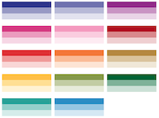
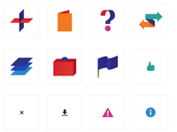

<nav>
  <ul class="home-menu">
    <li>
      <a href="design-patterns/"> 
        <figure>
          
            
          
          <figcaption>Design patterns</figcaption>
        </figure>
      </a>
    </li>
    <li>
      <a href="colours/"> 
        <figure>
          
            
          
          <figcaption>Colour palettes</figcaption>
        </figure>
      </a>
    </li>
      <li>
      <a href="icons/"> 
        <figure>
          
            
          
          <figcaption>Icons</figcaption>
        </figure>
      </a>
    </li>
  </ul>
</nav>

Find us on [github.com/alphagov](https://github.com/alphagov)

# Coding style guides (on Github)

* [CSS](https://github.com/alphagov/styleguides/blob/master/css.md)
* [HTML](https://github.com/alphagov/styleguides/blob/master/html.md)
* [Ruby](https://github.com/alphagov/styleguides/blob/master/ruby.md)
* [Git](https://github.com/alphagov/styleguides/blob/master/git.md)

# Creating prototypes for GOV.UK

We recommend you use the [GOV.UK prototyping app](https://github.com/alphagov/prototyping)

